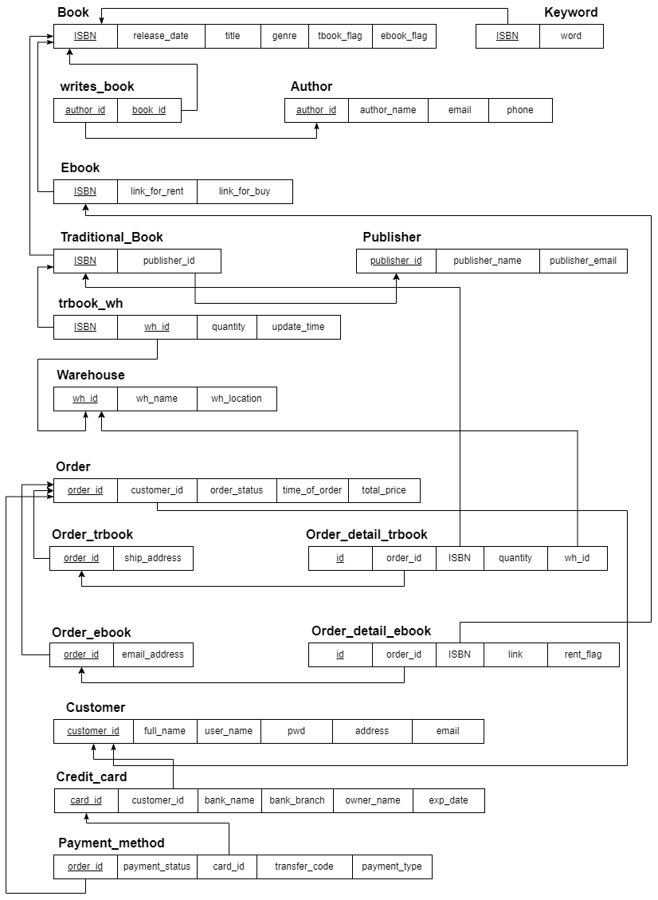
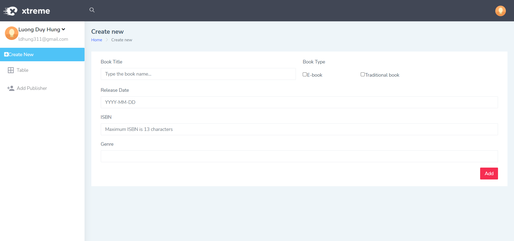
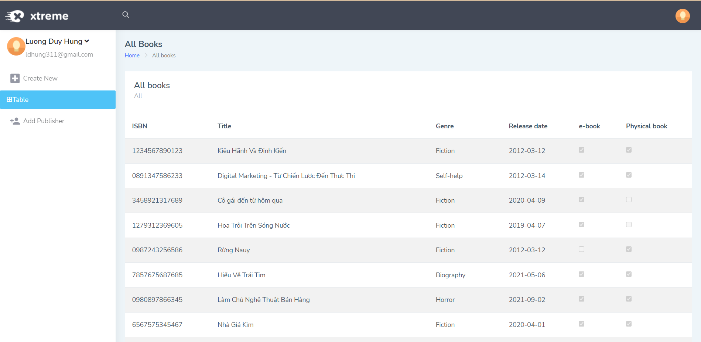
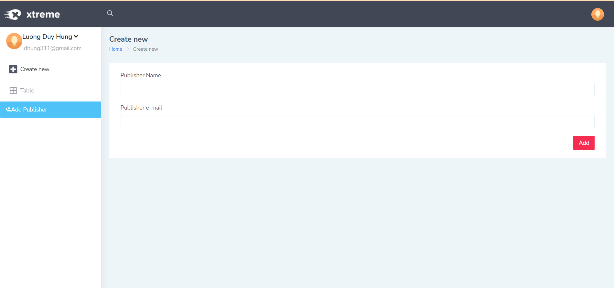

# tibber-ebookstore

### Tech stack
 - Java SE 1.8
 - Springboot framework
 - MySQL 
 - Thymeleaf template engine
### Objectives
 - Implemented a well-done and normalized database schema into real life application.
 
 

  
 

 - Built a website for inputing and viewing all books that are stored in that database.

 

  
 

 
  

  
 

 
 

  
 

 
 ## Disclamer
  - I used online website templates for the purpose of demonstrating this mini project. I will not in charge of any copyright infringement

 
